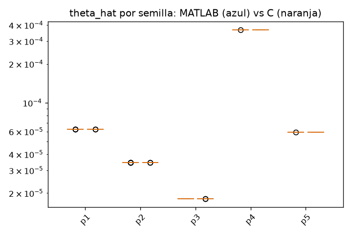

# Baseline capa 5 - ap

MATLAB: 10 semillas (C:\Users\david\Desktop\agent_cuqdyn-c\cuqdyn-c-git\validation\baseline\matlab\ap)
C:      10 semillas (C:\Users\david\Desktop\agent_cuqdyn-c\cuqdyn-c-git\validation\baseline\c\ap)

Ambos lados corren el pipeline completo con su propio optimizador estocastico; lo comparable son las distribuciones, no las semillas una a una.

### theta_hat (ajuste con todos los datos)

| param | MATLAB mediana [IQR] | C mediana [IQR] | C/MATLAB | IQR solapa |
|---|---|---|---|---|
| p1 | 6.223e-05 [6.223e-05, 6.223e-05] | 6.223e-05 [6.223e-05, 6.223e-05] | 1.000 | si |
| p2 | 3.446e-05 [3.446e-05, 3.446e-05] | 3.446e-05 [3.446e-05, 3.446e-05] | 1.000 | si |
| p3 | 1.811e-05 [1.811e-05, 1.811e-05] | 1.811e-05 [1.81e-05, 1.811e-05] | 1.000 | si |
| p4 | 0.0003672 [0.0003672, 0.0003672] | 0.0003672 [0.0003671, 0.0003673] | 1.000 | si |
| p5 | 5.935e-05 [5.935e-05, 5.935e-05] | 5.934e-05 [5.932e-05, 5.939e-05] | 1.000 | si |

Parametros en desacuerdo (sin solape de IQR y medianas a >0.1%): **0 / 5**. Con >=10 semillas por lado, mas de uno merece mirarse.

### Mediana de parametros del ensemble LOO

| param | MATLAB mediana [IQR] | C mediana [IQR] | C/MATLAB | IQR solapa |
|---|---|---|---|---|
| p1 | 6.326e-05 [6.326e-05, 6.326e-05] | 6.326e-05 [6.326e-05, 6.326e-05] | 1.000 | si |
| p2 | 3.441e-05 [3.441e-05, 3.441e-05] | 3.441e-05 [3.441e-05, 3.441e-05] | 1.000 | si |
| p3 | 1.821e-05 [1.821e-05, 1.821e-05] | 1.821e-05 [1.821e-05, 1.821e-05] | 1.000 | si |
| p4 | 0.0003616 [0.0003616, 0.0003616] | 0.0003615 [0.0003615, 0.0003616] | 1.000 | si |
| p5 | 5.94e-05 [5.94e-05, 5.94e-05] | 5.932e-05 [5.93e-05, 5.934e-05] | 0.999 | **NO** |

Parametros en desacuerdo (sin solape de IQR y medianas a >0.1%): **1 / 5**. Con >=10 semillas por lado, mas de uno merece mirarse.

### Bandas por estado

| estado | anchura mediana MATLAB | anchura mediana C | C/MATLAB | cobertura MATLAB | cobertura C |
|---|---|---|---|---|---|
| y1 | 42.57 | 42.57 | 1.000 | 1.000 | 1.000 |
| y2 | 23.07 | 23.07 | 1.000 | 1.000 | 1.000 |
| y3 | 3.601 | 3.603 | 1.001 | 1.000 | 1.000 |
| y4 | 3.318 | 3.321 | 1.001 | 1.000 | 1.000 |
| y5 | 11.17 | 11.17 | 1.000 | 1.000 | 1.000 |

Cobertura = fraccion de puntos (t>0, todas las semillas) donde la trayectoria verdadera cae dentro de [q_low, q_up]. El nominal es 1 - 2*alp (0.95 para lv2, 0.90 para nfkb).

