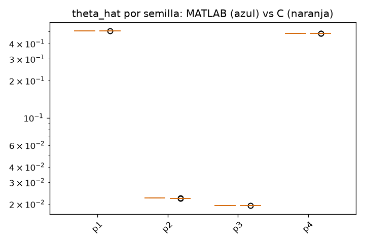

# Baseline capa 5 - lv2

MATLAB: 10 semillas (C:\Users\david\Desktop\agent_cuqdyn-c\cuqdyn-c-git\validation\baseline\matlab\lv2)
C:      10 semillas (C:\Users\david\Desktop\agent_cuqdyn-c\cuqdyn-c-git\validation\baseline\c\lv2)

Ambos lados corren el pipeline completo con su propio optimizador estocastico; lo comparable son las distribuciones, no las semillas una a una.

### theta_hat (ajuste con todos los datos)

| param | MATLAB mediana [IQR] | C mediana [IQR] | C/MATLAB | IQR solapa |
|---|---|---|---|---|
| p1 | 0.5074 [0.5074, 0.5074] | 0.5072 [0.5072, 0.5072] | 1.000 | si |
| p2 | 0.02228 [0.02228, 0.02228] | 0.02225 [0.02224, 0.02225] | 0.999 | **NO** |
| p3 | 0.01941 [0.01941, 0.01941] | 0.01943 [0.01942, 0.01943] | 1.001 | si |
| p4 | 0.4833 [0.4833, 0.4833] | 0.4836 [0.4835, 0.4836] | 1.001 | si |

Parametros en desacuerdo (sin solape de IQR y medianas a >0.1%): **1 / 4**. Con >=10 semillas por lado, mas de uno merece mirarse.

### Mediana de parametros del ensemble LOO

| param | MATLAB mediana [IQR] | C mediana [IQR] | C/MATLAB | IQR solapa |
|---|---|---|---|---|
| p1 | 0.5076 [0.5076, 0.5076] | 0.5076 [0.5076, 0.5076] | 1.000 | si |
| p2 | 0.02232 [0.02231, 0.02232] | 0.02231 [0.02231, 0.02231] | 1.000 | si |
| p3 | 0.0194 [0.0194, 0.0194] | 0.01941 [0.01941, 0.01941] | 1.000 | si |
| p4 | 0.483 [0.483, 0.483] | 0.4831 [0.4831, 0.4831] | 1.000 | si |

Parametros en desacuerdo (sin solape de IQR y medianas a >0.1%): **0 / 4**. Con >=10 semillas por lado, mas de uno merece mirarse.

### Bandas por estado

| estado | anchura mediana MATLAB | anchura mediana C | C/MATLAB | cobertura MATLAB | cobertura C |
|---|---|---|---|---|---|
| y1 | 15.47 | 15.46 | 1.000 | 1.000 | 1.000 |
| y2 | 13.79 | 13.81 | 1.001 | 1.000 | 1.000 |

Cobertura = fraccion de puntos (t>0, todas las semillas) donde la trayectoria verdadera cae dentro de [q_low, q_up]. El nominal es 1 - 2*alp (0.95 para lv2, 0.90 para nfkb).

