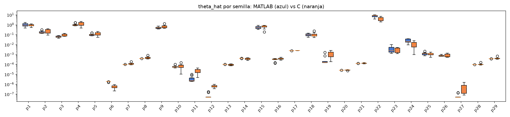

# Baseline capa 5 - nfkb

MATLAB: 10 semillas (C:\Users\david\Desktop\agent_cuqdyn-c\cuqdyn-c-git\validation\baseline\matlab\nfkb)
C:      10 semillas (C:\Users\david\Desktop\agent_cuqdyn-c\cuqdyn-c-git\validation\baseline\c\nfkb)

Ambos lados corren el pipeline completo con su propio optimizador estocastico; lo comparable son las distribuciones, no las semillas una a una.

### theta_hat (ajuste con todos los datos)

| param | MATLAB mediana [IQR] | C mediana [IQR] | C/MATLAB | IQR solapa |
|---|---|---|---|---|
| p1 | 0.9104 [0.7511, 1.281] | 0.8366 [0.8066, 1.041] | 0.919 | si |
| p2 | 0.1572 [0.1449, 0.1996] | 0.2585 [0.1473, 0.3357] | 1.645 | si |
| p3 | 0.06326 [0.05436, 0.0734] | 0.08483 [0.07354, 0.1148] | 1.341 | **NO** |
| p4 | 0.9452 [0.8235, 1.066] | 1.298 [0.8971, 1.736] | 1.373 | si |
| p5 | 0.09466 [0.08367, 0.1056] | 0.1268 [0.08996, 0.1654] | 1.339 | si |
| p6 | 1.999e-06 [1.959e-06, 2e-06] | 5.26e-07 [4.399e-07, 7.216e-07] | 0.263 | **NO** |
| p7 | 9.937e-05 [9.9e-05, 9.963e-05] | 0.0001114 [0.0001014, 0.0001282] | 1.121 | **NO** |
| p8 | 0.0003945 [0.0003928, 0.0003959] | 0.0004577 [0.0004049, 0.0005232] | 1.160 | **NO** |
| p9 | 0.5042 [0.4153, 0.5576] | 0.6185 [0.4979, 0.7795] | 1.227 | si |
| p10 | 5.48e-05 [5.253e-05, 6.32e-05] | 6.674e-05 [4.903e-05, 8.651e-05] | 1.218 | si |
| p11 | 2.366e-06 [2.059e-06, 4.382e-06] | 2.205e-05 [1.533e-05, 3.116e-05] | 9.318 | **NO** |
| p12 | 5.058e-08 [5.007e-08, 5.268e-08] | 5.968e-07 [5.225e-07, 7.471e-07] | 11.801 | **NO** |
| p13 | 0.0001029 [0.0001027, 0.000103] | 9.153e-05 [8.295e-05, 0.0001048] | 0.889 | si |
| p14 | 0.0004144 [0.0004132, 0.0004147] | 0.0003552 [0.0003123, 0.0004269] | 0.857 | si |
| p15 | 0.5179 [0.4137, 0.6696] | 0.7418 [0.5895, 0.7853] | 1.432 | si |
| p16 | 0.0003418 [0.0003132, 0.0003591] | 0.0003802 [0.000332, 0.0004296] | 1.113 | si |
| p17 | 0.002499 [0.002498, 0.0025] | 0.002572 [0.002514, 0.002589] | 1.029 | **NO** |
| p18 | 0.09549 [0.07676, 0.1245] | 0.07857 [0.07436, 0.1171] | 0.823 | si |
| p19 | 0.0001657 [0.0001534, 0.0001998] | 0.001294 [0.0005971, 0.001694] | 7.809 | **NO** |
| p20 | 2.591e-05 [2.59e-05, 2.593e-05] | 2.735e-05 [2.594e-05, 2.744e-05] | 1.056 | **NO** |
| p21 | 0.0001295 [0.0001293, 0.0001296] | 0.000135 [0.0001292, 0.0001386] | 1.043 | si |
| p22 | 8.47 [6.303, 9] | 4.3 [2.616, 5.311] | 0.508 | **NO** |
| p23 | 0.002434 [0.001765, 0.005257] | 0.003269 [0.00152, 0.004522] | 1.343 | si |
| p24 | 0.02065 [0.01775, 0.03618] | 0.01234 [0.005646, 0.01678] | 0.598 | **NO** |
| p25 | 0.001263 [0.0009518, 0.001399] | 0.001236 [0.0009562, 0.001295] | 0.979 | si |
| p26 | 0.0007442 [0.0006667, 0.0008354] | 0.0007029 [0.0006092, 0.001087] | 0.944 | si |
| p27 | 5.016e-08 [5.003e-08, 5.158e-08] | 5.01e-07 [1.212e-07, 7.767e-07] | 9.987 | **NO** |
| p28 | 9.572e-05 [9.572e-05, 9.572e-05] | 9.811e-05 [9.586e-05, 0.000102] | 1.025 | **NO** |
| p29 | 0.0003787 [0.0003787, 0.0003787] | 0.0003885 [0.0003808, 0.0004147] | 1.026 | **NO** |

Parametros en desacuerdo (sin solape de IQR y medianas a >0.1%): **14 / 29**. Con >=10 semillas por lado, mas de uno merece mirarse.

### Mediana de parametros del ensemble LOO

| param | MATLAB mediana [IQR] | C mediana [IQR] | C/MATLAB | IQR solapa |
|---|---|---|---|---|
| p1 | 0.851 [0.8104, 0.8647] | 0.8434 [0.8133, 1.034] | 0.991 | si |
| p2 | 0.1743 [0.1684, 0.1842] | 0.2607 [0.1539, 0.3039] | 1.496 | si |
| p3 | 0.06486 [0.05993, 0.07487] | 0.09082 [0.07676, 0.1126] | 1.400 | **NO** |
| p4 | 0.9143 [0.8799, 0.9421] | 1.298 [0.8949, 1.733] | 1.419 | si |
| p5 | 0.09213 [0.08886, 0.09455] | 0.1271 [0.09002, 0.1651] | 1.379 | si |
| p6 | 1.925e-06 [1.861e-06, 1.96e-06] | 5.324e-07 [4.393e-07, 7.159e-07] | 0.277 | **NO** |
| p7 | 9.935e-05 [9.918e-05, 9.94e-05] | 0.0001053 [0.0001014, 0.000107] | 1.060 | **NO** |
| p8 | 0.0003944 [0.0003938, 0.0003949] | 0.0004243 [0.0004052, 0.0004329] | 1.076 | **NO** |
| p9 | 0.6097 [0.5952, 0.6189] | 0.6218 [0.5054, 0.7854] | 1.020 | si |
| p10 | 6.031e-05 [5.976e-05, 6.282e-05] | 6.713e-05 [5.111e-05, 8.418e-05] | 1.113 | si |
| p11 | 6.015e-06 [5.09e-06, 7.901e-06] | 2.141e-05 [1.509e-05, 3.059e-05] | 3.559 | **NO** |
| p12 | 5.1e-08 [5.068e-08, 5.285e-08] | 5.993e-07 [5.312e-07, 7.365e-07] | 11.751 | **NO** |
| p13 | 0.0001029 [0.0001029, 0.000103] | 9.266e-05 [8.772e-05, 0.0001041] | 0.900 | si |
| p14 | 0.0004142 [0.0004142, 0.0004144] | 0.0003634 [0.0003373, 0.00042] | 0.877 | si |
| p15 | 0.4962 [0.4736, 0.5105] | 0.7311 [0.5698, 0.7737] | 1.473 | **NO** |
| p16 | 0.0003441 [0.0003355, 0.0003564] | 0.0003467 [0.0003041, 0.0003821] | 1.007 | si |
| p17 | 0.002499 [0.002499, 0.002499] | 0.002525 [0.002502, 0.002534] | 1.010 | **NO** |
| p18 | 0.1016 [0.09777, 0.1076] | 0.07753 [0.07345, 0.1146] | 0.763 | si |
| p19 | 0.0001637 [0.000163, 0.0001825] | 0.0008537 [0.0005793, 0.001267] | 5.215 | **NO** |
| p20 | 2.591e-05 [2.589e-05, 2.592e-05] | 2.647e-05 [2.581e-05, 2.679e-05] | 1.022 | si |
| p21 | 0.0001294 [0.0001293, 0.0001295] | 0.0001328 [0.0001294, 0.0001338] | 1.027 | si |
| p22 | 6.968 [6.4, 7.23] | 4.32 [2.744, 5.441] | 0.620 | **NO** |
| p23 | 0.003327 [0.003077, 0.003583] | 0.003226 [0.001531, 0.00436] | 0.970 | si |
| p24 | 0.02055 [0.0198, 0.0217] | 0.01235 [0.005762, 0.01606] | 0.601 | **NO** |
| p25 | 0.001033 [0.0009818, 0.001079] | 0.001235 [0.0009721, 0.001292] | 1.195 | si |
| p26 | 0.0007233 [0.000692, 0.000753] | 0.0007062 [0.0006108, 0.00109] | 0.976 | si |
| p27 | 5.621e-08 [5.411e-08, 5.774e-08] | 4.978e-07 [1.409e-07, 7.815e-07] | 8.856 | **NO** |
| p28 | 9.571e-05 [9.571e-05, 9.572e-05] | 9.752e-05 [9.616e-05, 9.933e-05] | 1.019 | **NO** |
| p29 | 0.0003786 [0.0003786, 0.0003787] | 0.000388 [0.0003808, 0.0003977] | 1.025 | **NO** |

Parametros en desacuerdo (sin solape de IQR y medianas a >0.1%): **14 / 29**. Con >=10 semillas por lado, mas de uno merece mirarse.

### Bandas por estado

| estado | anchura mediana MATLAB | anchura mediana C | C/MATLAB | cobertura MATLAB | cobertura C |
|---|---|---|---|---|---|
| y1 | 0.006039 | 0.006112 | 1.012 | 1.000 | 1.000 |
| y2 | 9.441e-06 | 9.318e-06 | 0.987 | 1.000 | 1.000 |
| y3 | 0.03473 | 0.03516 | 1.012 | 1.000 | 1.000 |
| y4 | 0.009169 | 0.01226 | 1.337 | 1.000 | 1.000 |
| y5 | 7.756e-06 | 7.733e-06 | 0.997 | 1.000 | 0.997 |
| y6 | 7.886e-05 | 0.00048 | 6.086 | 1.000 | 1.000 |
| y7 | 1.199e-05 | 9.724e-06 | 0.811 | 1.000 | 1.000 |
| y8 | 1.684e+05 | 2.603e+05 | 1.546 | 1.000 | 1.000 |
| y9 | 0.02922 | 0.03722 | 1.274 | 1.000 | 1.000 |
| y10 | 2.681e+04 | 3.321e+04 | 1.239 | 1.000 | 1.000 |
| y11 | 86.05 | 88.09 | 1.024 | 1.000 | 1.000 |
| y12 | 0.04416 | 0.0441 | 0.999 | 1.000 | 1.000 |
| y13 | 0.01396 | 0.01413 | 1.013 | 1.000 | 1.000 |
| y14 | 0.0003968 | 0.00171 | 4.311 | 1.000 | 1.000 |
| y15 | 0.04377 | 0.04354 | 0.995 | 1.000 | 1.000 |

Cobertura = fraccion de puntos (t>0, todas las semillas) donde la trayectoria verdadera cae dentro de [q_low, q_up]. El nominal es 1 - 2*alp (0.95 para lv2, 0.90 para nfkb).

