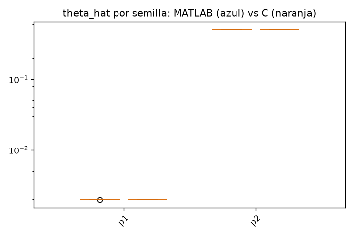

# Baseline capa 4 - sir

MATLAB: 10 semillas (validation/matlab/sir)
C:      10 semillas (validation/c/layer4/sir)

Ambos lados corren el pipeline completo con su propio optimizador estocastico; lo comparable son las distribuciones, no las semillas una a una.

### theta_hat (ajuste con todos los datos)

| param | MATLAB mediana [IQR] | C mediana [IQR] | C/MATLAB | IQR solapa |
|---|---|---|---|---|
| p1 | 0.001981 [0.001981, 0.001981] | 0.001981 [0.001981, 0.001981] | 1.000 | si |
| p2 | 0.4982 [0.4982, 0.4982] | 0.4982 [0.4982, 0.4982] | 1.000 | si |

Parametros en desacuerdo (sin solape de IQR y medianas a >0.1%): **0 / 2**. Con >=10 semillas por lado, mas de uno merece mirarse.

### Mediana de parametros del ensemble LOO

| param | MATLAB mediana [IQR] | C mediana [IQR] | C/MATLAB | IQR solapa |
|---|---|---|---|---|
| p1 | 0.001981 [0.001981, 0.001981] | 0.001981 [0.001981, 0.001981] | 1.000 | si |
| p2 | 0.4982 [0.4982, 0.4982] | 0.4982 [0.4982, 0.4982] | 1.000 | si |

Parametros en desacuerdo (sin solape de IQR y medianas a >0.1%): **0 / 2**. Con >=10 semillas por lado, mas de uno merece mirarse.

### Bandas por estado

| estado | anchura mediana MATLAB | anchura mediana C | C/MATLAB | cobertura MATLAB | cobertura C |
|---|---|---|---|---|---|
| y1 | 10.18 | 10.18 | 1.000 | 1.000 | 1.000 |
| y2 | 44.93 | 44.94 | 1.000 | 1.000 | 1.000 |
| y3 | 9.349 | 9.349 | 1.000 | 1.000 | 1.000 |

Cobertura = fraccion de puntos (t>0, todas las semillas) donde la trayectoria verdadera cae dentro de [q_low, q_up]. El nominal es 1 - 2*alp (0.95 para lv2, 0.90 para nfkb).

